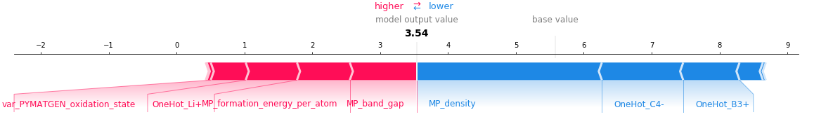

Data repository for the publication: ***Modelling the dielectric constants of crystals using machine learning***

## Background
This work is mainly composed of two parts: machine learning and SHAP analysis.
Overall aim is to extract physically and chemically meaningful trends from trained machine learning model (in our case support vector regression).

## Contents

#### Setting up Docker environment

docker build --rm -t mlshap .
docker run -it -p 8080:8080 --name testmlsvr --mount type=bind,source=$(pwd),target=/home/anaconda/mount testmlsvr

#### Notebooks

**[Steps 1: Machine learning](https://github.com/WMD-group/Dielectric_ML/blob/master/step1_ml_training.ipynb)**

- Train a support vector regression (SVR) model
- Check the performance as done in the main paper

**[Step 2: Shapley additive explanation analysis](https://github.com/WMD-group/Dielectric_ML/blob/master/step2_shap_analyses.ipynb)

- analyse the whole database
- analyse individual data

#### Data

The required data can be downloaded separately from the above Zenodo DOI link and should be untarred directly into this directory, creating a sub-directory named `data`.

### Dependencies

The notebooks and the dataset make use of many Python packages:

- [matplotlib](https://matplotlib.org/)
- [numpy](https://numpy.org)
- [pandas](https://pandas.pydata.org)
- [pymatgen](http://pymatgen.org)
- [scikit-learn](https://scikit-learn.org/stable/)
- [SHAP](https://github.com/slundberg/shap)
- [smact](https://github.com/WMD-group/smact)

The jupyter notebooks and the datasets follow the copyrights of above packages.
Package versions specified in the Docker file.

### Caveats

- The dataset was downloaded from `Materials Project` in March 2020. Therefore it may differ from the current database.
- Although using Docker should reproduce the result to a high degree, due to strong environmental dependence, the result may differ from the main paper.
- Many different libraries are used and I am not an expert in all of them: some of the code is probably far from elegant!

